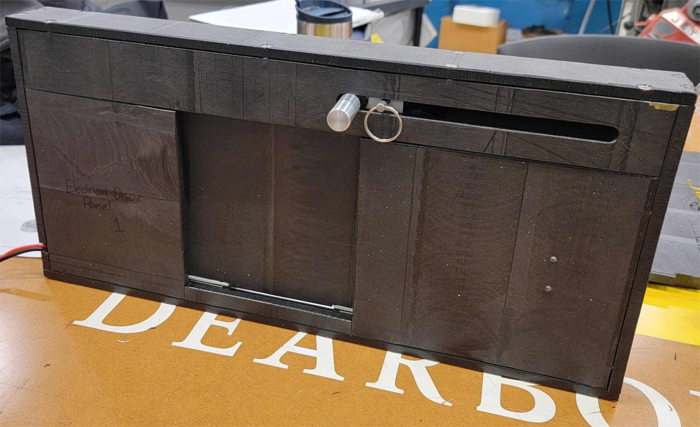
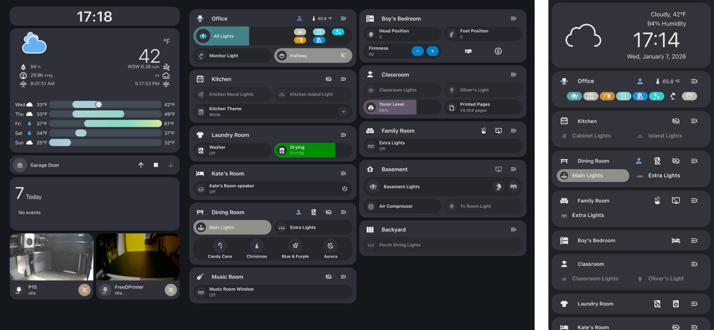
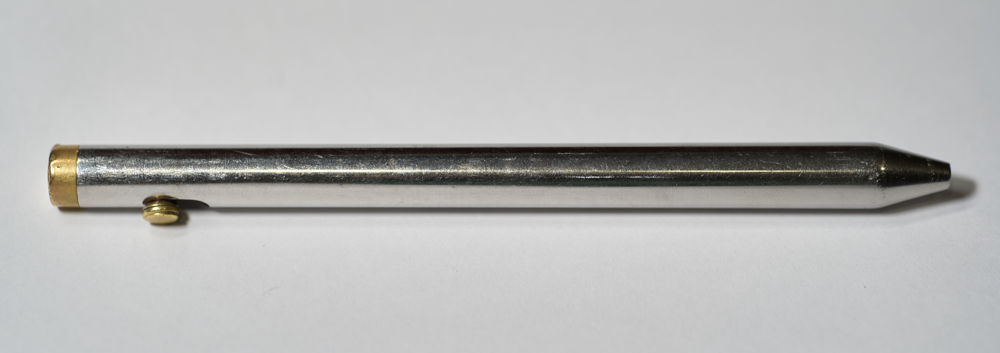

---
hide:
  - footer
  - toc
  - navigation
---

# 💼 Portfolio

I am a Mechanical Engineer (MS '25) and Dual Citizen (US/DE) with a passion for building rugged, integrated systems. My work bridges the gap between mechanical design, embedded electronics, and the compute infrastructure that powers them.

Below is a selection of projects demonstrating my ability to design, prototype, and deploy complex electromechanical systems.

---

## 💻 Software & Model-Based Systems Engineering (MBSE)

### **Open Source SysML Core & Carbon Solver (Thesis)**

<!-- { align=right width="450" style="border-radius: 5px;"} -->

*Bridging the gap between static system models and dynamic python analysis.*

* **Contribution:** Contributed directly to the Gaphor open-source project to implement SysML 1.6 constraints and parametrics.
* **The Solver:** Authored a Python library that bridges Gaphor models with external analysis scripts.
* **Application:** Developed a multi-modal mapping algorithm (Truck/Rail/Sea/Air) to calculate accurate shipping carbon footprints, writing the results directly back into the system model for visualization.

**Tech Stack:** `Python` `SysML` `Gaphor` `Open Source Contribution` `Git`

### **Automated 3D Printer Calibration**

*Computer vision integration for manufacturing optimization.*

Developed a closed-loop calibration system to optimize linear advance settings for 3D printers automatically.

* **Workflow:** The system prints a test pattern, scans it using a high-precision GoCator 3D Profiler, and processes the point cloud data.
* **Analysis:** Wrote a custom MATLAB algorithm to analyze the scan topography, identify the most consistent extrusion line, and output the optimal K-factor.

**Tech Stack:** `MATLAB` `GoCator` `Computer Vision` `Metrology`

---

## 🛠️ Electromechanical Systems & Robotics

### **Smart Dog Door: Integrated Mechatronics**

{ align=right width="450" style="border-radius: 5px;"}

***Senior Design Capstone Project.** A ruggedized, automated entry system integrating RFID logic, cloud connectivity, and custom mechanical actuation.*

* **The Challenge:** Design a secure pet door that distinguishes between authorized/unauthorized entities and integrates with smart home ecosystems.
* **Mechanical Design:** Fabricated a custom housing and locking mechanism using a manual mill. Designed linkages to interface the servo actuator with the steel locking pin.
* **Electronics & Code:** Wired an ESP32 microcontroller with an RFID reader and Wi-Fi module. Programmed logic for tag validation and Alexa API integration.
* **Outcome:** A fully functional, field-tested prototype capable of remote operation and "pet-only" access.

**Tech Stack:** `ESP32` `Arduino` `SolidWorks` `Manual Mill` `RFID`

<video autoplay loop muted playsinline width="450" style="float: right; margin-top: 20px; margin-left: 20px; border-radius: 5px;">
  <source src="./assets/PineWoodDerbyGate.mov" type="video/quicktime">
</video>

### **Pinewood Derby Finish Gate**

*An automated race timing system requiring micro-second precision and custom sensor alignment.*

* **System Architecture:** Independently designed, wired, and programmed a multi-lane finish gate.
* **Fabrication:** Designed and 3D printed alignment mechanisms to hold laser gates in line.
* **Logic:** Utilized an ESP32 to process signals from laser receivers and drive a real-time display output.

**Tech Stack:** `ESP32` `Arduino` `3D Printing` `Laser Sensors` `Wiring Harness Design`

### **Binder Jet Printer Electronics**
*Research prototype development.*

Designed and documented the complete electronics system for a custom Binder Jet 3D printer prototype at U of M Dearborn. Focus was placed on clean cable management, EMI reduction, and accessible documentation for future researchers.

**Tech Stack:** `Electronics Design` `Soldering` `Wire Harnessing`

---

## 🖥️ Infrastructure, Compute & Automation

### **HPC Lab Infrastructure (Systems Admin)**
*Building the digital backbone for engineering research.*

As the Lab Systems Administrator at U of M Dearborn, I solely designed and deployed the lab's GPU-accelerated compute and storage infrastructure from the ground up.

* **Compute:** Deployed Proxmox VE clusters managing NVIDIA L40S GPUs for simulation and AI workloads. Leading procurement for next-gen RTX PRO 6000 servers.
* **Storage:** Architected a TrueNAS core for high-speed, fault-tolerant data storage (NFS/SMB) linked via 50GbE.
* **Orchestration:** Deployed and currently manage a k3s Kubernetes cluster (Zero-to-JupyterHub) to serve MBSE course environments.

**Tech Stack:** `Proxmox` `Kubernetes (k3s)` `TrueNAS` `Linux` `NVIDIA HPC` `Docker`

### **Home Lab & Automation**

{ align=right width="450" style="border-radius: 5px;"}

*A personal testbed for networking, IoT, and virtualization.*

* **Infrastructure:** Maintain a custom Proxmox virtualization cluster and a TP-Link Omada network architecture.
* **Automation:** Run a self-hosted Home Assistant instance to automate and connect my home environment.
* **Custom Hardware:** Design and solder custom ESP32 sensors (PIR presence detection, WLED lighting) that integrate via MQTT/REST.

### **3D Printer Engineering (FLSUN Build)**
*Deep-dive into firmware and motion kinematics.*

* **Build:** Assembled an barebones FLSUN i3 kit from component level, then designed and fabricated upgrades to enhance the printer.
* **Optimization:** Self-taught Marlin firmware compiling to enable advanced thermal protection and motion features.
* **Remote Management:** Deployed OctoPrint for telemetry and remote control.

---

## ⚙️ Precision Fabrication & Manufacturing

### **Bolt Action Pen**

{ align=right width="450" style="border-radius: 5px;"}

*Manual machining and mechanism design.*

Designed a custom pen body and bolt-actuation mechanism to fit a standard Pilot G2 refill.

* **Fabrication:** Manufactured the body and internal mechanism from stainless steel and brass using a manual lathe and drill press.
* **Design:** Modeled in SolidWorks with tight tolerances to ensure smooth actuation without binding.

### **Jet Fuel Nozzle Adapter**
*Rapid prototyping and material validation.*

* **Challenge:** Adapt a standard duckbill jet fuel nozzle to fit a custom helicycle fuel tank geometry.
* **Validation:** Designed and 3D printed the adapter in PLA. Validated material compatibility by soaking test coupons in kerosene for 72+ hours to ensure structural integrity before field use.

### **Industrial Casting (Becker GmbH - Germany)**
*Large-scale manufacturing and quality assurance.*

During my rotation as a Manufacturing Engineer in a German aluminum foundry, I gained full-lifecycle experience with automotive cylinder heads:

* **Digital:** Simulation via Magnasoft and CAD via NX.
* **Physical:** Operated SLM 280HL (Metal Printing) and sand core pressing/blowing machinery.
* **Validation:** Verified critical engine components using CT Scanning and CMM (Coordinate Measuring Machine), as well as destructive tensile testing.

---

## 📽️ Creative & Media

### **Technical Director (Fairlane Alliance Church)**
*Complete AVL Architecture Overhaul.*

Led the transition from analog systems to a fully integrated digital broadcast environment.

* **Video:** Integrated ATEM Mini switchers and Bitfocus Companion for automated stream management.
* **Audio:** Deployed Behringer Wing console.
* **Lighting:** Programmed ONYX console for dynamic stage lighting.

### **Custom sACN LED Fixtures**
*Engineering meets Stage Design.*

To reduce costs while maintaining professional features, I engineered custom LED lighting tubes.

* **Hardware:** ESP32 microcontrollers driving WS2812b LED strips inside diffused housings.
* **Protocol:** Implemented sACN (Streaming ACN) via WLED, allowing the DIY fixtures to be controlled directly by the professional ONYX lighting console alongside commercial fixtures.

**Tech Stack:** `WLED` `sACN` `ESP32` `ONYX` `Stage Lighting`